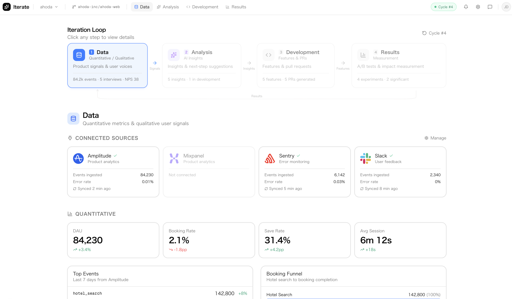

<p align="center">
  
</p>

<h1 align="center">Iterate</h1>

<p align="center">
  <strong>Closed-loop AI Product Manager</strong><br />
  Data → Analysis → Development → Results — then back again.
</p>

<p align="center">
  
  
  
  
  
  
</p>

---

<p align="center">
  
</p>

<p align="center">
  <video src="apps/web/public/demo.mp4" width="100%" autoplay loop muted playsinline>
    Your browser does not support the video tag.
  </video>
</p>

---

## What is Iterate?

Iterate is an AI-powered product management platform that closes the loop between data, insight, and execution. It continuously monitors product analytics, user interviews, and support signals — surfaces actionable insights — generates engineering tasks and PRs — measures results — and feeds learnings back into the next cycle.

```
┌──────────┐     ┌──────────┐     ┌──────────┐     ┌──────────┐
│   Data   │────▶│ Analysis │────▶│   Dev    │────▶│ Results  │
│          │     │          │     │          │     │          │
│ Metrics  │     │ AI cross-│     │ Tasks &  │     │ A/B exp  │
│ Events   │     │ reference│     │ PRs auto │     │ KPI lift │
│ NPS      │     │ & reco   │     │ generated│     │ tracking │
└──────────┘     └──────────┘     └──────────┘     └──────────┘
      ▲                                                  │
      └──────────────────────────────────────────────────┘
                        Continuous loop
```

## Architecture

```
iterate/
├── apps/
│   ├── web/              # Next.js 16 — Dashboard & AI chat UI
│   └── symphony/         # Elixir/Phoenix — Real-time orchestration engine
├── packages/
│   ├── ai/               # Unified AI provider (OpenAI, Anthropic, Codex)
│   └── database/         # Prisma ORM + PostgreSQL schema
├── docker-compose.yml    # Local infrastructure (PostgreSQL 17)
├── Makefile              # Developer commands (run `make help`)
├── turbo.json            # Turborepo pipeline config
└── .env.example          # Environment template
```

| Layer | Tech | Purpose |
|-------|------|---------|
| **Frontend** | Next.js 16, React 19, Tailwind v4, shadcn/ui | Dashboard, iteration loop visualization, AI chat |
| **Backend** | Elixir/Phoenix (Symphony) | Real-time event processing, webhook orchestration |
| **AI** | `@iterate/ai` package | Unified OpenAI + Anthropic + Codex abstraction |
| **Database** | PostgreSQL 17, Prisma 6 | Product data, insights, experiments, audit log |
| **Infra** | Turborepo, pnpm workspaces, Docker Compose | Monorepo orchestration, local dev environment |

## Quick Start

### Prerequisites

- **Node.js** >= 20
- **pnpm** >= 10
- **Docker** (for PostgreSQL)

### Setup

```bash
# Clone and setup everything in one command
git clone https://github.com/iterateapp/iterate.git
cd iterate
make setup
```

This will:
1. Copy `.env.example` → `.env`
2. Install all dependencies
3. Start PostgreSQL via Docker
4. Push the Prisma schema to the database

### Development

```bash
# Start all apps
make dev

# Or start individually
make dev-web        # http://localhost:3000
make dev-symphony   # http://localhost:4000
```

### AI Configuration

Add your API keys to `.env`:

```bash
# At minimum, set one of these:
ANTHROPIC_API_KEY=sk-ant-...    # Claude (default provider)
OPENAI_API_KEY=sk-...           # GPT-4.1 / o3 / Codex

# Verify connectivity
make ai-check
make ai-test
```

## Available Commands

Run `make help` for the full list:

```
  setup              First-time project setup
  dev                Start all apps in development mode
  dev-web            Start only the web app
  dev-symphony       Start only the Symphony backend
  build              Build all packages and apps
  lint               Lint all packages and apps
  typecheck          Run TypeScript type checking
  clean              Remove all build artifacts and node_modules
  db-up              Start PostgreSQL via Docker Compose
  db-down            Stop PostgreSQL
  db-push            Push Prisma schema to database
  db-migrate         Run Prisma migrations
  db-studio          Open Prisma Studio
  db-reset           Reset database (drop + recreate)
  ai-check           Verify AI provider API keys are configured
  ai-test            Send a test prompt to verify AI connectivity
  ci                 Run full CI pipeline locally
  pre-commit         Pre-commit checks (lint + typecheck)
```

## `@iterate/ai` Package

Unified provider abstraction with streaming support:

```typescript
import { createAIClient, MODELS } from "@iterate/ai"

const ai = createAIClient({
  defaultModel: MODELS["claude-sonnet-4"],
  systemPrompt: "You are a product analyst.",
})

// Simple one-shot
const answer = await ai.ask("What drove the booking rate drop?")

// Full conversation with streaming
await ai.chatStream(
  [
    { role: "user", content: "Analyze the Save vs Book gap" },
  ],
  (chunk) => process.stdout.write(chunk.content),
  { model: MODELS["gpt-4.1"] }  // Override model per-call
)
```

**Supported models:**

| Provider | Models |
|----------|--------|
| Anthropic | `claude-opus-4`, `claude-sonnet-4`, `claude-haiku-3.5` |
| OpenAI | `gpt-4.1`, `gpt-4.1-mini`, `gpt-4.1-nano`, `o3`, `o4-mini` |
| OpenAI Codex | Autonomous PR generation via task API |

## API Endpoints

| Method | Path | Description |
|--------|------|-------------|
| `POST` | `/api/ai/chat` | AI chat completion (supports SSE streaming) |

**Request:**
```json
{
  "messages": [{ "role": "user", "content": "..." }],
  "model": "claude-sonnet-4",
  "stream": true
}
```

## Project Principles

- **Closed-loop by default** — Every insight leads to action, every action is measured, every measurement feeds back.
- **AI-native, not AI-bolted** — AI isn't a feature; it's the core reasoning engine across all four steps.
- **Data-driven decisions** — Cross-reference quantitative metrics with qualitative signals. Never rely on one source alone.
- **Ship fast, measure immediately** — Auto-generate PRs, auto-setup A/B experiments, auto-track results.

## License

Private — All rights reserved.
