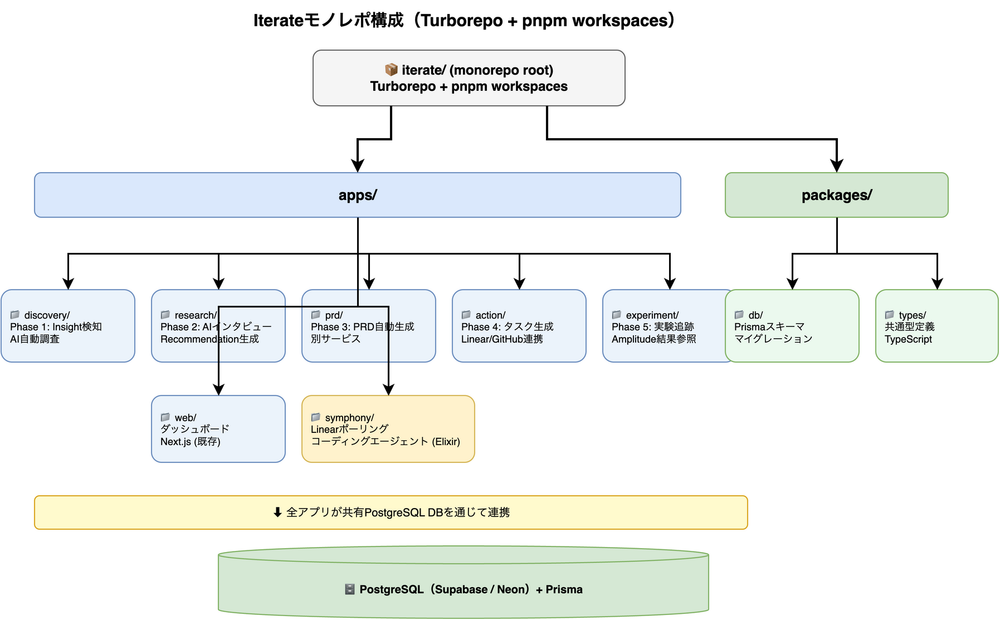
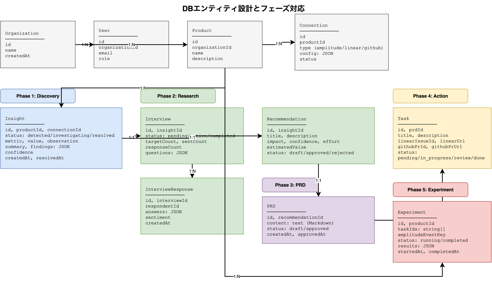

# Iterate — アーキテクチャ設計

> DBエンティティを中心に、AIが自動でループを回すプロダクト改善システム

---

## 全体構成



各サービスは**共有PostgreSQL DBを通じて連携**する。Symphony（`apps/symphony/`）はLinearをポーリングしてGitHub PRを自動作成する。

---

## DBエンティティ設計



### Organization / User / Product / Connection（初期セットアップ）

```
Organization
  id, name, createdAt

User
  id, organizationId, email, role

Product
  id, organizationId, name, description

Connection
  id, productId
  type: "amplitude" | "linear" | "github"
  config: JSON  ← API keys, project IDs など
  status: "active" | "error"
```

### Insight（Phase 1）

```
Insight
  id, productId, connectionId (amplitude)
  status: "detected" | "investigating" | "resolved"

  # detected 時点で埋まる
  metric: string        ← "mobile_churn_rate"
  value: number         ← 0.15
  observation: string   ← "モバイル離脱率が+15%"

  # investigating → resolved で埋まる
  summary: string
  findings: JSON
  confidence: number    ← 0.87

  createdAt, resolvedAt
```

### Interview / InterviewResponse（Phase 2）

```
Interview
  id, insightId
  status: "pending" | "active" | "completed"
  targetCount: number   ← 20
  sentCount: number
  responseCount: number
  questions: JSON

InterviewResponse
  id, interviewId
  respondentId: string  ← ユーザーID or 匿名ID
  answers: JSON
  sentiment: string
  createdAt
```

### Recommendation（Phase 2 → 3）

```
Recommendation
  id, insightId
  title: string
  description: string
  impact: "high" | "medium" | "low"
  confidence: number
  effort: "high" | "medium" | "low"
  estimatedValue: string   ← "月$45K回復"
  status: "draft" | "approved" | "rejected"
```

### PRD（Phase 3、別サービス）

```
PRD
  id, recommendationId
  content: text    ← Markdown形式の要件定義
  status: "draft" | "approved"
  createdAt, approvedAt
```

### Task（Phase 4）

```
Task
  id, prdId
  title: string
  description: string
  linearIssueId: string
  linearUrl: string
  githubPrId: string
  githubPrUrl: string
  status: "pending" | "in_progress" | "review" | "done"
```

### Experiment（Phase 5）

```
Experiment
  id, productId
  taskIds: string[]
  amplitudeEventKey: string   ← 結果を参照するAmplitudeイベント
  status: "running" | "completed"
  results: JSON               ← メトリクス変化量
  startedAt, completedAt
```

---

## フルループフロー

```
┌─────────────────────────────────────────────────────────────────┐
│  初期セットアップ（一回のみ）                                      │
│  Organization作成 → User作成 → Product作成                       │
│  → Connection設定（Amplitude, Linear, GitHub）                   │
└─────────────────────────────────────────────────────────────────┘
                           ↓
┌─────────────────────────────────────────────────────────────────┐
│  Phase 1: Discovery（discovery/）                                │
│                                                                  │
│  Connection(Amplitude) からデータ取得                             │
│    → Insight 作成（status: detected）                            │
│    → AI が自動調査（status: investigating）                       │
│    → summary / findings / confidence を埋める                    │
│    → Insight 更新（status: resolved）← 定量分析完了              │
└─────────────────────────────────────────────────────────────────┘
                           ↓
┌─────────────────────────────────────────────────────────────────┐
│  Phase 2: Research（research/）                                  │
│                                                                  │
│  Insight に紐づく Interview 作成                                  │
│    → 影響ユーザーにインタビューを送付                               │
│    → InterviewResponse が蓄積                                    │
│    → 定量 + 定性を統合して Recommendation 作成                    │
│    → PM が承認（status: approved）← Human in the loop           │
└─────────────────────────────────────────────────────────────────┘
                           ↓
┌─────────────────────────────────────────────────────────────────┐
│  Phase 3: PRD（prd/）← 別サービス                                 │
│                                                                  │
│  Recommendation から PRD を自動生成                               │
│    → PM がレビュー・承認（status: approved）← Human in the loop  │
└─────────────────────────────────────────────────────────────────┘
                           ↓
┌─────────────────────────────────────────────────────────────────┐
│  Phase 4: Action（action/）                                      │
│                                                                  │
│  PRD の内容を Task に分解                                         │
│    → Connection(Linear) に同期（linearIssueId 取得）              │
│    → Symphony（apps/symphony/）が Linear をポーリング             │
│    → コーディングエージェントが PR 作成                             │
│    → Connection(GitHub) に PR リンクを保存                        │
│    ※ Linear → Slack 通知は Linear 側の設定で対応                  │
└─────────────────────────────────────────────────────────────────┘
                           ↓
┌─────────────────────────────────────────────────────────────────┐
│  Phase 5: Experiment（experiment/）                              │
│                                                                  │
│  リリース後、Experiment 作成                                       │
│    → Connection(Amplitude) で結果を参照                           │
│    → results に変化量を記録（status: completed）                  │
└─────────────────────────────────────────────────────────────────┘
                           ↓
                  次の Insight を検知 → ループ
```

---

## Symphony 連携

Symphony（`apps/symphony/`）は **モノレポ内の独立サービス** として動作する。Elixir/OTP 実装。

```
Linear（Task作成済み）
      │
      │ ポーリング（30秒ごと）
      ▼
┌──────────────────┐
│  apps/symphony/  │ ── コーディングエージェント起動
│  (Elixir/OTP)    │ ── issueごとに隔離ワークスペースで実装
│                  │ ── PR 作成 → Linear を Human Review へ
└──────────────────┘
      │
      ▼
  GitHub PR
```

- `apps/symphony/WORKFLOW.md` で Linear プロジェクト・ポーリング間隔・エージェント設定を管理
- Task ごとに隔離されたワークスペースでエージェントを起動（並列実行対応）
- 失敗時はリトライ（指数バックオフ）、完了後は Linear を `Human Review` ステータスに移行
- PR 作成後、Iterate 側の Task に `githubPrUrl` を書き戻す（Webhook or polling）
- オプション: `--port 4000` で Phoenix LiveView ダッシュボードを起動

**起動方法：**
```bash
cd apps/symphony
mise exec -- mix setup && mix build
LINEAR_API_KEY=xxx ./bin/symphony ./WORKFLOW.md --port 4000
```

---

## 技術スタック

| レイヤー | 技術 |
|---------|------|
| フレームワーク | Next.js 15（App Router） |
| モノレポ管理 | Turborepo + pnpm workspaces |
| DB | PostgreSQL（Supabase or Neon）+ Prisma |
| AI（Discovery） | Anthropic Claude API |
| AI（Research） | OpenAI Realtime API or Claude |
| AI（PRD・Action） | Anthropic Claude API |
| 外部連携 | Amplitude API, Linear API, GitHub API |
| Symphony | `apps/symphony/`（Elixir/OTP、Railway/Fly.io にデプロイ） |
| デプロイ | Vercel |

---

## Human in the loop

| フェーズ | 承認ポイント | スキップ可否 |
|---------|------------|-----------|
| Phase 2 | Recommendation を承認 | 設定で自動化可 |
| Phase 3 | PRD を承認 | 設定で自動化可 |
| Phase 4 | Task リストを承認（Linear 登録前） | 設定で自動化可 |
| Phase 4 | PR をレビュー（エンジニア） | 必須 |

---

## 参考

- [overview.md](./overview.md) — プロダクトビジョン・ストーリー
- [competitive-research.md](./competitive-research.md) — 詳細な競合調査
