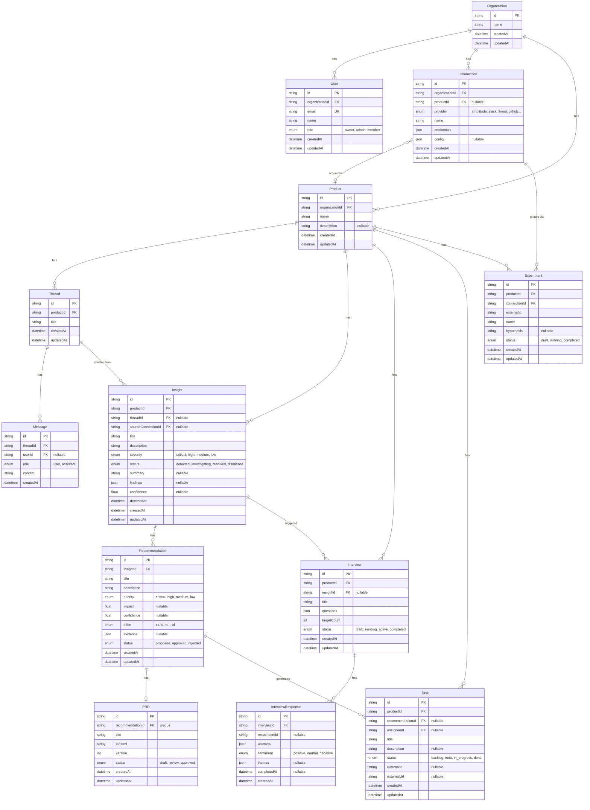
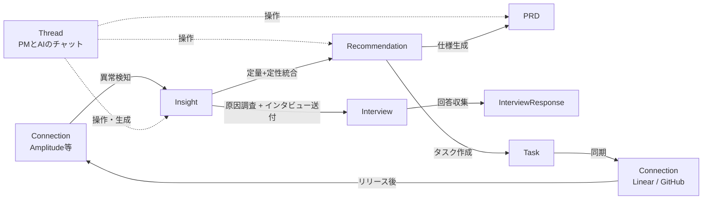

# Iterate データベーススキーマ設計

## ER図

## モデル詳細

### Organization

| カラム | 型 | 説明 |
|--------|------|------|
| id | String (cuid) | PK |
| name | String | 組織名 |
| createdAt | DateTime | 作成日時 |
| updatedAt | DateTime | 更新日時 |

### User

| カラム | 型 | 説明 |
|--------|------|------|
| id | String (cuid) | PK |
| organizationId | String | FK → Organization |
| email | String (unique) | メールアドレス |
| name | String? | 表示名 |
| role | Enum (owner, admin, member) | 権限 |
| createdAt | DateTime | 作成日時 |
| updatedAt | DateTime | 更新日時 |

### Connection

外部サービスとの接続。データ取り込み（Amplitude等）とアクション送出（Slack, Linear, GitHub等）の両方を統一管理。

| カラム | 型 | 説明 |
|--------|------|------|
| id | String (cuid) | PK |
| organizationId | String | FK → Organization |
| productId | String? | FK → Product（GitHub等プロダクト単位のもの） |
| provider | Enum | amplitude, mixpanel, zendesk, slack, linear, github, notion |
| name | String | 表示名（「本番Amplitude」等） |
| credentials | Json | 認証情報（トークン等） |
| config | Json? | プロバイダ固有の設定 |
| createdAt | DateTime | 作成日時 |
| updatedAt | DateTime | 更新日時 |

### Product

| カラム | 型 | 説明 |
|--------|------|------|
| id | String (cuid) | PK |
| organizationId | String | FK → Organization |
| name | String | プロダクト名 |
| description | String? | 説明 |
| createdAt | DateTime | 作成日時 |
| updatedAt | DateTime | 更新日時 |

### Thread

PMとAIの会話スレッド。チャットからInsight等の各モデルを操作できる。

| カラム | 型 | 説明 |
|--------|------|------|
| id | String (cuid) | PK |
| productId | String | FK → Product |
| title | String | スレッドタイトル（AI自動生成） |
| createdAt | DateTime | 作成日時 |
| updatedAt | DateTime | 更新日時 |

### Message

チャットメッセージ。

| カラム | 型 | 説明 |
|--------|------|------|
| id | String (cuid) | PK |
| threadId | String | FK → Thread |
| userId | String? | FK → User（PMの発言時） |
| role | Enum (user, assistant) | 発言者 |
| content | String | メッセージ本文 |
| createdAt | DateTime | 作成日時 |

### Insight

AIが検知した異常や発見。コアループの起点。調査結果も含む。

| カラム | 型 | 説明 |
|--------|------|------|
| id | String (cuid) | PK |
| productId | String | FK → Product |
| threadId | String? | FK → Thread（会話から生まれた場合） |
| sourceConnectionId | String? | FK → Connection（検知元） |
| title | String | 「モバイル離脱率 +15%」等 |
| description | String | 詳細説明 |
| severity | Enum (critical, high, medium, low) | 重要度 |
| status | Enum (detected, investigating, resolved, dismissed) | 状態 |
| summary | String? | 調査結果のまとめ |
| findings | Json? | 構造化された調査結果 |
| confidence | Float? | 信頼度（0-1） |
| detectedAt | DateTime | 検知日時 |
| createdAt | DateTime | 作成日時 |
| updatedAt | DateTime | 更新日時 |

### Interview

AIインタビュー。Productに直接紐づき、横断検索可能。

| カラム | 型 | 説明 |
|--------|------|------|
| id | String (cuid) | PK |
| productId | String | FK → Product |
| insightId | String? | FK → Insight（調査起点の場合） |
| title | String | インタビュータイトル |
| questions | Json | 質問リスト |
| targetCount | Int | 送付対象人数 |
| status | Enum (draft, sending, active, completed) | 状態 |
| createdAt | DateTime | 作成日時 |
| updatedAt | DateTime | 更新日時 |

### InterviewResponse

インタビューへの個別回答。

| カラム | 型 | 説明 |
|--------|------|------|
| id | String (cuid) | PK |
| interviewId | String | FK → Interview |
| respondentId | String? | 回答者の識別子 |
| answers | Json | 回答内容 |
| sentiment | Enum (positive, neutral, negative)? | 感情分析結果 |
| themes | Json? | 抽出されたテーマ |
| completedAt | DateTime? | 回答完了日時 |
| createdAt | DateTime | 作成日時 |

### Recommendation

定量+定性を統合したAIの提案。

| カラム | 型 | 説明 |
|--------|------|------|
| id | String (cuid) | PK |
| insightId | String | FK → Insight |
| title | String | 「チェックアウトフローを5→2ステップに短縮」等 |
| description | String | 提案の詳細 |
| priority | Enum (critical, high, medium, low) | 優先度 |
| impact | Float? | 推定インパクト（金額等） |
| confidence | Float? | 信頼度（0-1） |
| effort | Enum (xs, s, m, l, xl)? | 工数見積もり |
| evidence | Json? | 根拠（定量データ、インタビュー引用等） |
| status | Enum (proposed, approved, rejected) | PMの判断 |
| createdAt | DateTime | 作成日時 |
| updatedAt | DateTime | 更新日時 |

### PRD

Recommendationから自動生成された仕様書。

| カラム | 型 | 説明 |
|--------|------|------|
| id | String (cuid) | PK |
| recommendationId | String (unique) | FK → Recommendation（1:1） |
| title | String | PRDタイトル |
| content | String | 本文（Markdown） |
| version | Int | バージョン番号 |
| status | Enum (draft, review, approved) | 状態 |
| createdAt | DateTime | 作成日時 |
| updatedAt | DateTime | 更新日時 |

### Task

PRDから生まれたタスク。Iterate内で管理し、外部ツールにも同期可能。

| カラム | 型 | 説明 |
|--------|------|------|
| id | String (cuid) | PK |
| productId | String | FK → Product |
| recommendationId | String? | FK → Recommendation（出どころ） |
| title | String | タスクタイトル |
| description | String? | 詳細 |
| status | Enum (backlog, todo, in_progress, done) | 状態 |
| assigneeId | String? | FK → User |
| externalId | String? | 外部ツール上のID（Linear等） |
| externalUrl | String? | 外部ツールへのリンク |
| createdAt | DateTime | 作成日時 |
| updatedAt | DateTime | 更新日時 |

### Experiment

A/Bテストの記録。結果データは connectionId 経由で外部APIから取得。

| カラム | 型 | 説明 |
|--------|------|------|
| id | String (cuid) | PK |
| productId | String | FK → Product |
| connectionId | String | FK → Connection（結果参照先） |
| externalId | String | 外部ツール上の実験ID |
| name | String | 実験名 |
| hypothesis | String? | 仮説 |
| status | Enum (draft, running, completed) | 状態 |
| createdAt | DateTime | 作成日時 |
| updatedAt | DateTime | 更新日時 |

## フロー

