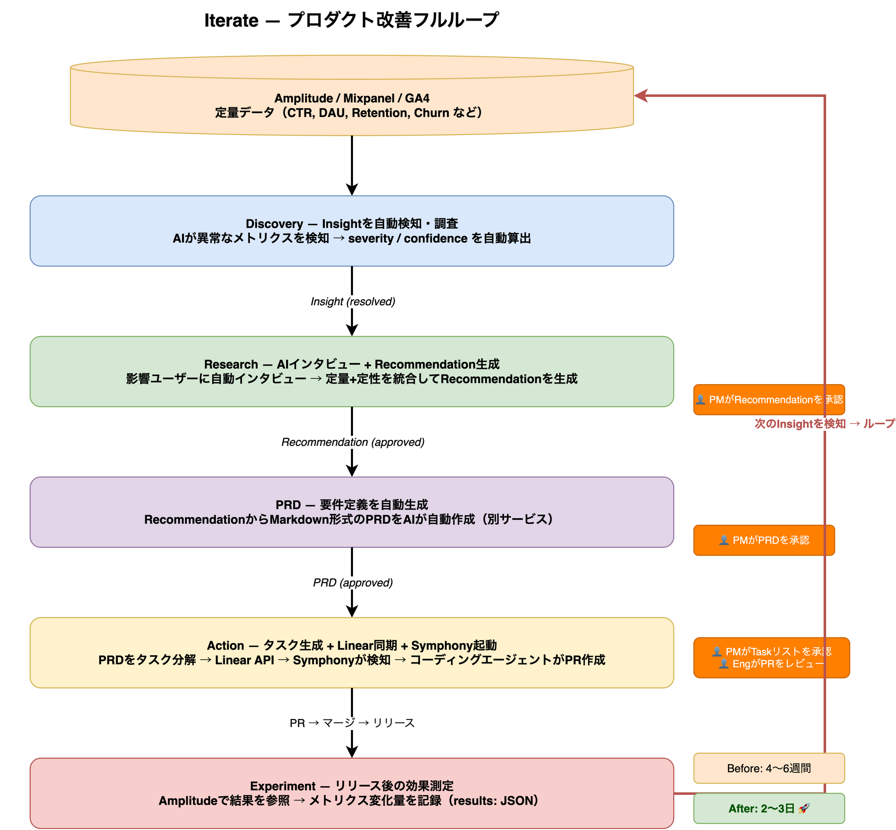
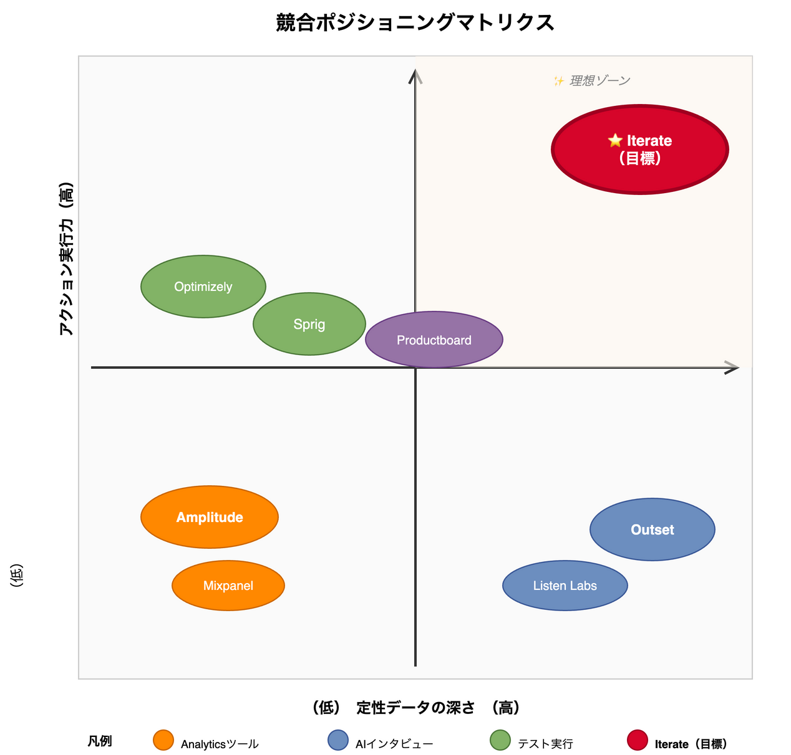

# Iterate — プロダクト概要

> 定量データ → 定性検証 → アクション のフルループを閉じるAI-native PMツール

---

## なぜ今も、プロダクトチームは半盲状態なのか

プロダクトチームは今日、**3つのバラバラなツール**で生きている。

- **Amplitude**：「Tab BのCTRが0.8%です」→ *なぜ* かは教えてくれない
- **Listen Labs / Outset**：ユーザーに聞く → でも**何を聞けばいいか**は自分で考える
- **Optimizely**：A/Bテストする → でも**何を試せばいいか**は自分で考える

この3者は**完全に断絶している**。ツール間の橋渡しをしているのは、疲弊したPMの脳みそだけだ。

### マーケ・広告業界はこれを5年前に解決した

Adobe Target、Persado、DCO（Dynamic Creative Optimization）——
定性インサイトから数十のクリエイティブバリアントを自動生成し、同時に多変量テストする。
広告の改善速度は人間のA/Bテストの10倍以上。

**プロダクト向けには、誰もやっていない。ここが白地。**

---

## Iterateとは何か

**定量データ（analytics）を起点に、AIが自動でInsightを検知・調査し、ユーザーインタビューで検証し、PRDを自動生成してLinearにタスクを積み、SymphonyがコーディングエージェントにPRを自動実装させる——プロダクト改善のフルループを自動化するツール。**

各フェーズは**共有PostgreSQL DBのエンティティ**でつながり、人間がゲートで承認/修正できる。
自動でも手動でも流せる、**Human in the loop**設計。

---

## 競合と差別化

| 既存ツール | できること | できないこと |
|-----------|-----------|------------|
| Amplitude / Mixpanel | 「何が」起きているか分かる | 「なぜ」起きているかは分からない |
| Outset / Listen Labs | AIがインタビューできる | 定量データと繋がっていない、タスクにならない |
| Optimizely / LaunchDarkly | A/Bテストを実行できる | 仮説を生むインサイトがない |
| Sprig | in-appサーベイ + analytics | タスク生成・実行ができない |
| Productboard / Zeda | PM workflow管理 | リアルなユーザーデータと繋がっていない |

**Iterateだけが、定量シグナル → 定性検証 → アクション可能なタスク のフルループを閉じる。**

### ポジショニング

---

## ユーザーストーリー（具体例）

### Before Iterate

1. AmplitudeでTab BのCTRが0.8%と判明（所要時間：即時）
2. PM「なぜ使われないのか」を推測して仮説を立てる（所要時間：1日）
3. Listen Labsでインタビュー設計・募集・実施（所要時間：2週間）
4. インタビュー結果を分析してPRDを書く（所要時間：3日）
5. A/Bテストを1パターン実装してOptimizelyで実行（所要時間：1週間）
6. 結果：+0.3%改善（または判定不能）
7. ループ全体：**4〜6週間**

### After Iterate

1. AmplitudeをIterateに接続（初回セットアップのみ）
2. AIが自動でInsightを検知：「モバイル離脱率+15%」（status: detected）
3. AIが自動調査：「新決済フローのStep 3→4で離脱集中、信頼度87%」（status: investigating → resolved）
4. AIが影響ユーザーにインタビューを自動送付（20人 → 12人が回答）
5. 定量+定性を統合：Recommendationを自動生成「5ステップ→2ステップに短縮、月$45K回復」
6. PMが承認（status: approved）→ PRDを自動生成
7. PRDをタスク分解 → Linear同期 → Symphony がLinearをポーリング → コーディングエージェントがPR作成
8. リリース後、Experimentを作成 → Amplitudeで結果を参照 → 次のInsightへ
9. ループ全体：**2〜3日**（実装まで含む）

---

## なぜ今か

- **Andrew Ng「ボトルネックはコードではなく、何を作るかだ」**（HNでバズ、Iterateのピッチと完全一致）
- **Greylock「今がAI-native user research platformを作る最高のタイミング」**（2025/6公開）
- **KraftfulがAmplitudeに買収**（2025/7）→ 大企業からの市場需要証明
- **Outsetが$51M調達**（2025/12）→ AIインタビュー市場の成立証明

---

## MVP戦略

**Phase 1（仮説生成）+ Phase 2（AIインタビュー）から開始する。**

- Phase 1は競合が完全に空白の領域（「Amplitudeデータ×AIとの壁打ち」）
- Phase 2はOutset等でプルーフ済みの市場、TOMLで独立APIとしても提供可能
- Phase 3（Linear連携）は初期ユーザーの行動データを見てから繋げる

---

## 参考

- [competitive-research.md](./competitive-research.md) — 詳細な競合調査
- [architecture.md](./architecture.md) — 技術アーキテクチャ・TOMLスキーマ
- [pitch-demo-concept.md](./pitch-demo-concept.md) — デモ動画構成
