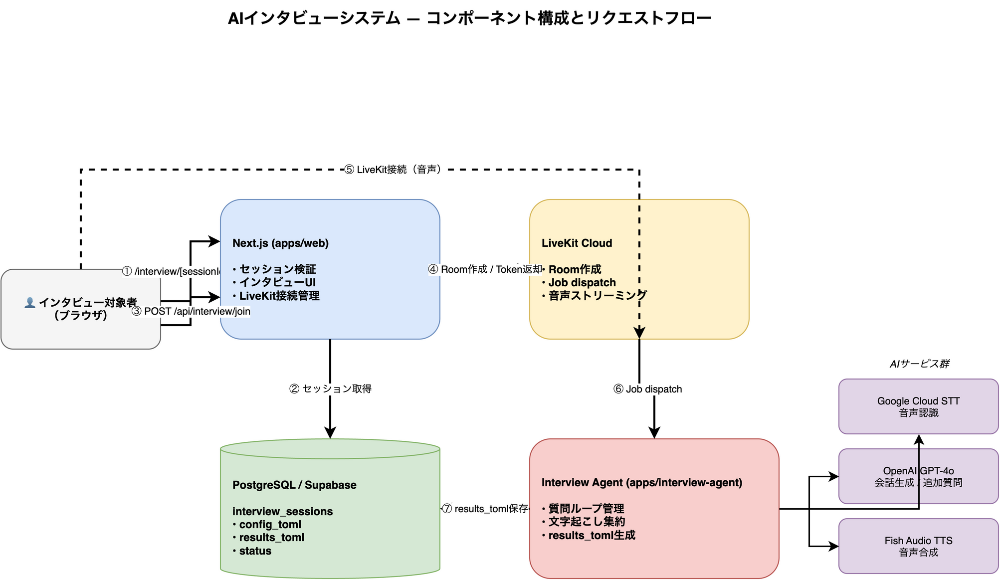

# AI Interview App — Design Document

Date: 2026-03-08

## Overview

Phase 2 of the Iterate product loop. A web-based AI voice interview app where an AI agent conducts user interviews based on a pre-defined question list (TOML config from Phase 1). Users access the interview via a unique URL. No authentication required for interviewees.

## System Context



```
Phase 1 (PM + AI chat) → config_toml → Supabase
                                            ↓ session_id in URL
Phase 2 (this app)     → /interview/[sessionId] → AI voice interview → results_toml → Supabase
                                                                                           ↓
Phase 3 (task creator) ← results_toml
```

## Architecture

### Monorepo Structure

```
apps/
  web/                                        # Next.js (existing)
    app/interview/[sessionId]/
      page.tsx                                # Public interview page
      loading.tsx
    app/api/interview/join/route.ts           # POST: create LiveKit room, return token
  interview-agent/                            # New Node.js app
    src/
      index.ts                                # Hono HTTP server (health + dispatch)
      agent.ts                                # LiveKit agent entry point
      infrastructure/
        tts/FishAudioTtsAdapter.ts            # Fish Audio custom TTS adapter
        stt/GoogleCloudSttAdapter.ts          # Google Cloud STT adapter
        llm/OpenAiAdapter.ts                  # OpenAI GPT-4o adapter
      application/
        interviewRunner.ts                    # Question loop orchestration
packages/
  database/                                   # Supabase client + schema helpers
  shared/                                     # TOML type definitions (InterviewConfig, InterviewResults)
```

### Request Flow

1. Interviewee opens `/interview/[sessionId]`
2. Next.js fetches session from Supabase → validates (exists, not expired, pending/in_progress)
3. User clicks "インタビューを開始" → POST `/api/interview/join` with `sessionId`
4. API route:
   - Reads `config_toml` from Supabase
   - Creates LiveKit room with `sessionId` as room name
   - Embeds `config_toml` as room metadata
   - Updates session status to `in_progress`
   - Returns `{ livekitUrl, accessToken }`
5. Frontend connects to LiveKit room via `livekit-client`
6. LiveKit dispatches job to `interview-agent` worker
7. Agent parses `config_toml` from job metadata
8. Agent conducts interview: question loop using Google STT → GPT-4o → Fish Audio TTS
9. On completion: agent saves `results_toml` to Supabase, marks session `completed`

## Database Schema (Supabase)

```sql
CREATE TYPE interview_status AS ENUM ('pending', 'in_progress', 'completed', 'expired');

CREATE TABLE interview_sessions (
  id            uuid PRIMARY KEY DEFAULT gen_random_uuid(),
  config_toml   text NOT NULL,         -- Phase 1 output
  results_toml  text,                  -- Phase 2 output (nullable until complete)
  status        interview_status NOT NULL DEFAULT 'pending',
  expires_at    timestamptz NOT NULL,
  created_at    timestamptz NOT NULL DEFAULT now()
);
```

No RLS required (server-side access only; public URL validation done in API route).

## TOML Formats

### Input: config_toml (Phase 1 → Phase 2)

```toml
[interview]
title = "機能Xユーザーヒアリング"
language = "ja"
interviewer_name = "AIインタビュアー"

[[questions]]
id = "q1"
text = "現在の○○機能をどのように使っていますか？"

[[questions]]
id = "q2"
text = "特に困っている点や改善してほしい点はありますか？"
```

### Output: results_toml (Phase 2 → Phase 3)

```toml
[session]
session_id = "uuid-here"
title = "機能Xユーザーヒアリング"
completed_at = "2026-03-08T12:00:00Z"
duration_seconds = 420

[[answers]]
question_id = "q1"
question = "現在の○○機能をどのように使っていますか？"
answer_summary = "週次レポート作成時に主に使用。データエクスポート機能を活用。"
full_transcript = """
Agent: 現在の○○機能をどのように使っていますか？
User: 主に週次レポートを作るときに使っています。
"""

[[answers]]
question_id = "q2"
question = "特に困っている点や改善してほしい点はありますか？"
answer_summary = "フィルタリング機能が不十分。日付範囲指定を改善してほしい。"
full_transcript = """
Agent: 特に困っている点や改善してほしい点はありますか？
User: フィルターがもう少し細かく設定できるといいですね。
"""
```

## Tech Stack

| Layer | Technology |
|-------|-----------|
| Frontend | Next.js 16 (apps/web) |
| Real-time audio | LiveKit Cloud |
| Agent framework | @livekit/agents (Node.js) |
| LLM | OpenAI GPT-4o |
| STT | Google Cloud Speech-to-Text |
| TTS | Fish Audio (custom adapter) |
| Database | Supabase (PostgreSQL) |
| Package manager | pnpm workspaces |

## Interview Agent Logic

```
on_job_start:
  1. Parse config_toml from room metadata
  2. Greet interviewee ("本日はよろしくお願いします。〜についていくつかお聞きします。")
  3. for each question in config_toml.questions:
       a. Ask question via TTS
       b. Listen for response (Google STT, with silence detection to detect end-of-answer)
       c. Append to transcript
       d. Optional: GPT-4o decides if follow-up needed (1 follow-up max per question)
  4. Close interview ("以上で終了です。ありがとうございました。")
  5. Disconnect from room

on_disconnect:
  1. Build results_toml from collected transcripts
  2. POST to Next.js API / direct Supabase write
  3. Update session status to 'completed'
```

## Frontend UI States

- `loading`: セッション情報取得中
- `invalid`: セッション無効（期限切れ or 存在しない）
- `completed`: インタビュー済み
- `idle`: 開始ボタン表示
- `connecting`: LiveKit接続中
- `interviewing`: インタビュー中（transcript表示 + ミュートボタン）
- `ended`: 完了メッセージ

## Fish Audio TTS Adapter

Fish Audio REST API (`https://api.fish.audio/v1/tts`) を使用。
voiceagent-v3 の `ElevenLabsTtsAdapter` と同パターンで実装：
- streaming audio chunks via ReadableStream
- voice model ID: configurable via env var `FISH_AUDIO_VOICE_ID`

## Environment Variables

### apps/web
```
NEXT_PUBLIC_LIVEKIT_URL=
SUPABASE_URL=
SUPABASE_SERVICE_ROLE_KEY=
LIVEKIT_API_KEY=
LIVEKIT_API_SECRET=
```

### apps/interview-agent
```
LIVEKIT_URL=
LIVEKIT_API_KEY=
LIVEKIT_API_SECRET=
OPENAI_API_KEY=
GOOGLE_CLOUD_CREDENTIALS=   # JSON keyfile path or content
FISH_AUDIO_API_KEY=
FISH_AUDIO_VOICE_ID=
SUPABASE_URL=
SUPABASE_SERVICE_ROLE_KEY=
PORT=4444
```

## Parallel Implementation Tasks

Independent tasks that can be implemented in parallel:

1. **DB + shared package** — Supabase schema, migration, TOML type defs
2. **Next.js interview page** — UI, session fetch, LiveKit connection
3. **Next.js API route** — `/api/interview/join`, LiveKit room creation
4. **interview-agent skeleton** — Agent worker, Hono health server
5. **Fish Audio TTS adapter** — Custom TTS implementation
6. **Google Cloud STT adapter** — Custom STT implementation
7. **Interview runner** — Question loop orchestration logic
